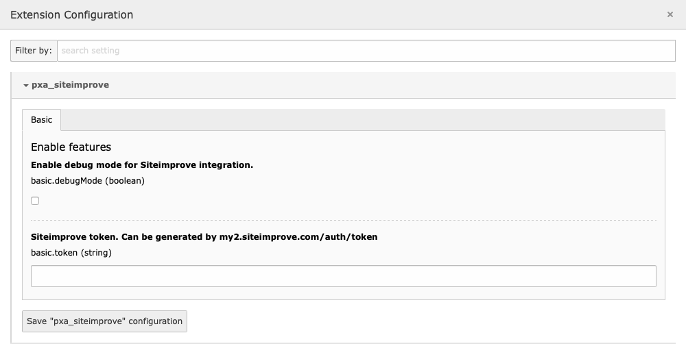

.. ==================================================
.. FOR YOUR INFORMATION
.. --------------------------------------------------
.. -*- coding: utf-8 -*- with BOM.

.. include:: ../Includes.txt

.. _configuration:

Configuration Reference
=======================

.. _extension-manager-settings:

Extension Manager settings
--------------------------

Administrators can modify these by going to the Settings module in the TYPO3
backend and clicking on Extension Configuration.

The following configuration options are available for the extension.

.. rst-class:: dl-parameters

Enable Siteimprove for all users with permissions
   :sep:`|` :aspect:`Property name:` enabledByDefault
   :sep:`|` :aspect:`Type:` boolean
   :sep:`|` :aspect:`Default:` false

   When this property is enabled, all users that have the User TSconfig setting
   options.siteImprove.enable set to 1 or true will see the Siteimprove widget in
   the page module. Users can disable Siteimprove for themselves by using the
   setting Disable Siteimprove in the User Settings

Enable debug mode for Siteimprove integration
   :sep:`|` :aspect:`Property name:` debugMode
   :sep:`|` :aspect:`Type:` boolean
   :sep:`|` :aspect:`Default:` false

   Display debug information for the API connection.

Siteimprove token
   :sep:`|` :aspect:`Property name:` token
   :sep:`|` :aspect:`Type:` string
   :sep:`|` :aspect:`Default:` ''

   The Siteimprove API token. This token is necessary to display the correct
   analysis information for your site.

   The token can be generated at https://my2.siteimprove.com/auth/token

.. note::
   In TYPO3 versions prior to version 9, these settings can be found by clicking
   the cogwheel icon in the Extension Manager module.

.. _user-settings:

User settings
-------------

.. rst-class:: bignums-xxl

1. Every user can access their user settings by clicking their username in
   TYPO3's top bar and choosing *User Settings* from the drop-down menu.

2. In the *Edit and Advanced functions* tab of the User settings, a checkbox
   allows each user to individually enable or disable the Siteimprove functions.

.. rst-class:: dl-parameters

Enable Siteimprove
   :sep:`|` :aspect:`Property name:` use_siteimprove
   :sep:`|` :aspect:`Type:` boolean
   :sep:`|` :aspect:`Default:` false

   A checkbox to toggle Siteimprove on and off

Disable Siteimprove
   :sep:`|` :aspect:`Property name:` disable_siteimprove
   :sep:`|` :aspect:`Type:` boolean
   :sep:`|` :aspect:`Default:` false

   A checkbox to disable Siteimprove although you have access to the feature

.. _user-tsconfig-settings:

User TSconfig settings
----------------------

You can also turn on and off the Siteimprove functionality for a single user or
a whole user group through User TSconfig settings.

.. rst-class:: dl-parameters

options.siteImprove.disable
   :sep:`|` :aspect:`Property name:` options.siteImprove.disable
   :sep:`|` :aspect:`Type:` boolean
   :sep:`|` :aspect:`Default:` false

   With this setting, you can disable Siteimprove although the editor itself
   enabled it in the User Settings. This option only works when you have not
   enabled Siteimprove by default.

options.siteImprove.enable
   :sep:`|` :aspect:`Property name:` options.siteImprove.enable
   :sep:`|` :aspect:`Type:` boolean
   :sep:`|` :aspect:`Default:` false

   With this setting, you can enable Siteimprove unless the editor itself
   disabled it in the User Settings. This option only works when you have
   enabled Siteimprove by default.
